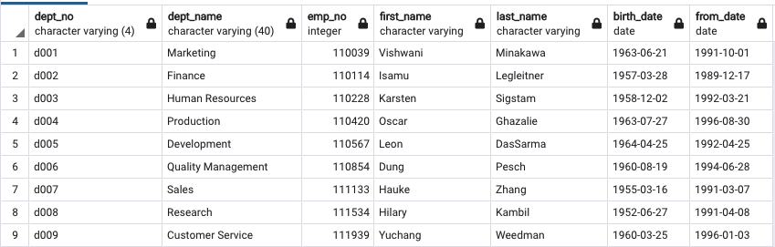

# Pewlett-Hackard-Analysis
BC Mod 7 - take 2

## Overview
Pewlett Hackard required an upgrade to employee tracking from previous methods. To this end, the employee files, previously contained in CSV (comma-separated values) files, have been imported and incorporated into a new Postgre SQL Database using pgAdmin software. A second, and equally important, task for this project includes identifying the employees that fall into the following categories:  
  
* Employees retiring soon;  
* Employees eligible for a new mentorship program.  


### Resources
Software: pgAdmin 4 (v. 5.7)  
Language: Postgre SQL  

## Results
This section focuses on the outputs noted in the second part of the overview listed above.  

### Deliverable 1
The first set of outputs for this project required identifying the position titles for employees that will be retiring soon. The following code was utilized to accomplish this task.  

```
-- DELIVERABLE 1 - Number of Retiring Employees by Title
SELECT	e.emp_no,
		e.first_name,
		e.last_name,
		t.title,
		t.from_date,
		t.to_date
INTO retirement_titles
FROM employees AS e
JOIN titles AS t
	ON (e.emp_no = t.emp_no)
WHERE (e.birth_date BETWEEN '1952-01-01' AND '1955-12-31')
ORDER BY e.emp_no ASC;


```

This produced the a list that can be found in the data folder of this repository: retirement_titles.csv.  

Next, employees with multiple titles, due to job changes, for example, were removed from the list, keepin only the final title.

```
-- Use Dictinct with Orderby to remove duplicate rows
SELECT DISTINCT ON (rt.emp_no) rt.emp_no,
	rt.first_name,
	rt.last_name,
	rt.title
INTO unique_titles
FROM retiring_titles AS rt
WHERE rt.to_date = ('9999-01-01')
ORDER BY rt.emp_no, rt.to_date DESC;
```
This produced the a list that can be found in the data folder of this repository: unique_titles.csv.  

Finally , the number of persons retiring per title were calculated using the following code.

```
-- Number of Titles
SELECT COUNT(title), title  
INTO retiring_titles  
FROM unique_titles
GROUP BY title
ORDER BY COUNT(title) DESC;
```

The results of this query can be seen below.  


Notably, the two major job positions that will experience retirements imminently are Senior Engineers (25,916) and Senior Staff (24,926). While an important position, only two (2) managers will be retiring soon.  

### Deliverable 2
The second set of outputs tied to imminent retirements at Pewlett Hackard pertain to the new Mentorship Program. The program is designed to partner retiring employees identified in the outputs above with employees that are slightly younger in order to pass along institutional knowledge to be retained within the organization.  

To identify those eligible for the program, the following code was utilized:  

```
-- DELIVERABLE 2 - Mentorship Program
SELECT DISTINCT ON (e.emp_no) e.emp_no,
		e.first_name,
		e.last_name,
		e.birth_date,
		de.from_date,
		de.to_date,
		t.title
INTO mentorship_eligibility
FROM employees AS e
JOIN dept_emp AS de
	ON (e.emp_no = de.emp_no)
JOIN titles AS t
	ON (e.emp_no = t.emp_no)
WHERE de.to_date = ('9999-01-01')
	AND (e.birth_date BETWEEN '1965-01-01' AND '1965-12-31')
ORDER BY e.emp_no ASC;
```

This provided a list of more than 1,500 employees eligible for mentorship. The csv file containing this list can be found in the data folder of this repository: mentorship_eligibility.csv.  

## Summary
Pewlett Hackard will soon experience a 'silver tsunami' with 72,458 employees retiring soon. As noted above, over 50,000 of those retirees will come from two position titles: Senior Engineer and Senior Staff. A further 17,000 retirees come from Engineers, Staff, and Assistant Engineers.  

Special note should be made of two particular position titles. There will be 3,603 Technique Leaders retiring. While only two (2) Managers will be retiring, given the size of Pewlett Hackard and the managerial responsibilities, their replacements should be prioritized.  

Regarding the Mentorship Program. There are a minimum of 1,900 employees per department that are retiring. See the following chart:  


This should ensure a sufficient number of retiring employees to mentor those eligible for the program as identified in Deliverable 2.

### Additional Insights
Pewlett Hackard will have $1.7B coming off the payroll shortly. This can be seen in the following:

``` 
SELECT DISTINCT ON (e.emp_no) e.emp_no,
		e.first_name,
		e.last_name, 
		ce.to_date,
		s.salary
INTO sal_saved
FROM employees AS e
JOIN salaries AS s
	ON (e.emp_no = s.emp_no)
JOIN current_emp AS ce
	ON (e.emp_no = ce.emp_no)
WHERE (e.birth_date BETWEEN '1952-01-01' AND '1955-12-31')
	AND (e.hire_date BETWEEN '1985-01-01' AND '1988-12-31')
	AND ce.to_date = ('9999-01-01')
ORDER BY e.emp_no, ce.to_date DESC;

SELECT CAST(SUM(salary) as money)
FROM sal_saved
```


In exploring the manager status for Pewlett Hackard, it has been noted that only two managers will be retiring soon. These two managers are in the Sales and Research departments. The next two managers eligible for retirement will be Isamu Legleitner (birth year: 1957) in Finance, and Karsten Sigstam (birth year: 1958) in Human Resources.

```
SELECT	dm.dept_no,
		d.dept_name,
		dm.emp_no,
		e.first_name,
		e.last_name,
		e.birth_date,
		dm.from_date
FROM dept_manager AS dm
JOIN departments AS d
	ON (dm.dept_no = d.dept_no)
JOIN employees AS e
	ON (dm.emp_no = e.emp_no)
WHERE to_date = '9999-01-01'
```


